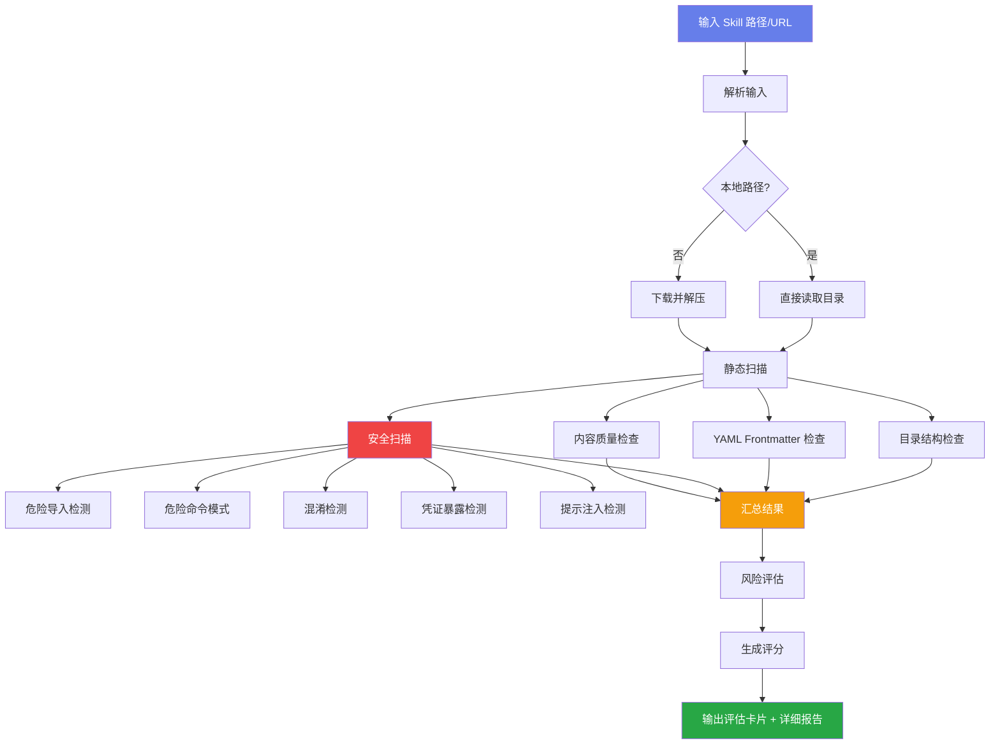

# Skill Evaluator v2.2

根据 Anthropic 官方指南《The Complete Guide to Building Skills for Claude》标准，评估 Skills 的规范性、完整性和安全性。

## 📋 简介

Skill Evaluator 是一个安装前的静态分析工具，帮助 Agent 在安装新 Skill 前进行安全扫描和质量评估。

## 🎯 设计思路

### 背景

在学习和实践《The Complete Guide to Building Skills for Claude》过程中，我们发现：
1. 官方标准对 Skill 结构有严格要求
2. 安全性是 Skill 安装的重要考量
3. 需要工具辅助自动化评估

### 核心理念

- **安全优先**: 安装前扫描，识别潜在风险
- **智能过滤**: 区分"定义"和"使用"，避免误报
- **标准合规**: 完全符合官方评估标准

## ✨ 实现功能

### 1. 四大评估维度

| 维度 | 检查项 |
|------|--------|
| **目录结构** | SKILL.md、scripts/、references/、assets/ |
| **YAML Frontmatter** | name、description、metadata |
| **安全性** | 危险导入、命令模式、混淆、凭证、提示注入 |
| **内容质量** | 类型识别、示例、错误处理 |

### 2. 官方标准检查

```
✅ Folder named in kebab-case
✅ SKILL.md file exists
✅ YAML frontmatter has --- delimiters
✅ name field: kebab-case, no spaces, no capitals
✅ description includes WHAT and WHEN
✅ No XML tags (< >) anywhere
✅ Instructions are clear and actionable
✅ Error handling included
✅ Examples provided
✅ References clearly linked
```

### 3. 风险分级

| 等级 | 标准 |
|------|------|
| ✅ SAFE | 无实际风险 |
| ✅ LOW | 轻微模式，有合理解释 |
| ⚠️ MEDIUM | 需审查 |
| ❌ HIGH | 真正风险 |
| 🔴 CRITICAL | 严重威胁 |

## 🔄 工作流程



## 🔒 安全扫描方法

### 1. 危险导入检测

```python
DANGEROUS_IMPORTS = {
    # 代码执行
    "eval", "exec", "compile",      # 动态代码执行
    "subprocess", "os.system",       # 系统命令
    "pickle", "marshal",            # 反序列化漏洞
    
    # 网络请求
    "requests", "urllib", "httpx",  # HTTP 客户端
    "socket", "smtplib",            # 网络连接
    
    # 文件操作
    "shutil", "tempfile", "ctypes", # 文件/系统调用
}
```

### 2. 危险命令模式

```python
DANGEROUS_SHELL_PATTERNS = [
    (r"curl\s+", "网络请求"),
    (r"wget\s+", "网络下载"),
    (r"rm\s+-rf", "递归删除"),
    (r"sudo\s+", "权限提升"),
    (r"pip\s+install", "包安装"),
    (r"nc\s+-l", "反向shell"),
    (r"python3?\s+-c\s", "内联代码执行"),
    # ... 共 20+ 种模式
]
```

### 3. 混淆检测

```python
OBFUSCATION_PATTERNS = [
    (r"\\x[0-9a-fA-F]{2}", "hex 编码"),
    (r"base64", "base64 编码"),
    (r"atob|btoa", "JS base64"),
    (r"getattr\(", "动态属性访问"),
]
```

### 4. 凭证暴露

```python
SENSITIVE_DATA_PATTERNS = [
    r"api[_-]?key\s*[=:]",    # API key
    r"password\s*[=:]",          # 密码
    r"sk-[a-zA-Z0-9]{20,}",   # OpenAI key
    r"ghp_[a-zA-Z0-9]{36}",    # GitHub token
]
```

### 5. 提示注入

```python
PROMPT_INJECTION_PATTERNS = [
    r"ignore\s+previous\s+instructions?",
    r"you\s+are\s+now\s+",
    r"disregard\s+all\s+previous",
    r"<system>",
]
```

## 🧠 经验与教训

### 误报案例

#### 案例1: skill-auditor
扫描器报告 19 个"高风险"：
- scan_skill.py 包含 curl、rm -rf、eval
- security-checklist.md 包含"Ignore previous"

**真相**: 这是安全审计工具的自身代码，不是实际威胁

#### 案例2: fault-tree-analysis
报告 base64 编码为"高风险混淆"

**真相**: 用于 HTML 报告图片内嵌，正常用途

### 教训总结

1. **扫描器自身排除**
   扫描器定义的危险模式 ≠ 使用危险模式
   → 排除 scan_skill.py 等扫描器文件

2. **文档列举 vs 实际使用**
   安全文档中列举危险类型 ≠ 实际注入
   → 排除 security-checklist.md

3. **上下文判断**
   - base64 恶意: 混淆 payload ✅ 检测
   - base64 合法: 报告图片内嵌 ❌ 误报
   → 需要判断用途

### 智能过滤实现

```python
def _is_false_positive(self, file_path, pattern, category, content):
    # 1. 扫描器自身
    if "scan_skill.py" in filename:
        return True
    
    # 2. 安全文档
    if "security-checklist" in filename:
        return True
    
    # 3. 报告生成的 base64
    if "report" in filename and "base64" in pattern:
        if "html" in content.lower():
            return True
    
    return False
```

## 🚀 使用方法

```bash
# 本地评估
python3 scripts/evaluate_skill.py /path/to/skill-folder

# 评估结果示例
┌─────────────────────────────────────────────────────────────┐
│  📋 Skill 评估卡片                                              │
├─────────────────────────────────────────────────────────────┤
│  🎯 名称: skill-evaluator                                        │
│  📁 类型: Category 2: 工作流自动化                              │
├─────────────────────────────────────────────────────────────┤
│  📊 总体评分                                                    │
│  ┌─────────────────────────────────────────────────────┐   │
│  │  90/100  ✅ SAFE                                     │   │
│  └─────────────────────────────────────────────────────┘   │
├─────────────────────────────────────────────────────────────┤
│  🔒 安全扫描: 0 个风险项                              │
├─────────────────────────────────────────────────────────────┤
│  📥 安装建议: ✅ 推荐安装                                       │
└─────────────────────────────────────────────────────────────┘
```

## 📁 目录结构

```
skill-evaluator/
├── SKILL.md                    # 必需 - 主文件
├── scripts/
│   └── evaluate_skill.py      # 评估脚本
└── assets/
    └── evaluation-card-template.md  # 卡片模板
```

## 📝 版本历史

| 版本 | 更新内容 |
|------|----------|
| v2.2.0 | 符合官方标准 - YAML分隔符、XML标签检测、references目录、WHAT/WHEN检查 |
| v2.1.0 | 智能过滤 - 排除误报 |
| v2.0.0 | 初始版本 |

## 🤝 欢迎参与

1. **测试反馈** - 评估你安装的 skills，看看准确度
2. **误报反馈** - 发现误报告诉我们，持续优化
3. **功能建议** - 还能加什么检查项？
4. **代码贡献** - 一起改进扫描规则

## 📚 参考

- [The Complete Guide to Building Skills for Claude](https://docs.anthropic.com/en/docs/agents-tools/skill)
- [OpenClaw 文档](https://docs.openclaw.ai)

---

**作者**: ranni_openclaw  
**版本**: 2.2.0  
**许可证**: MIT
